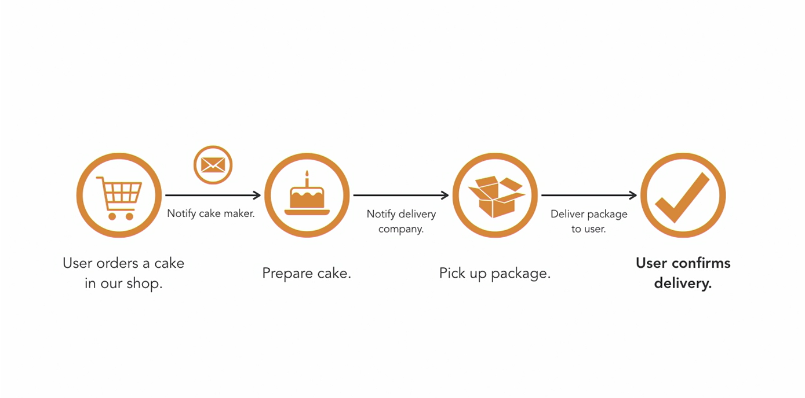
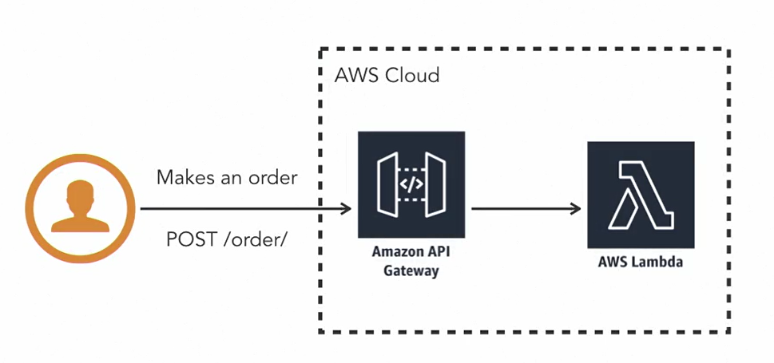
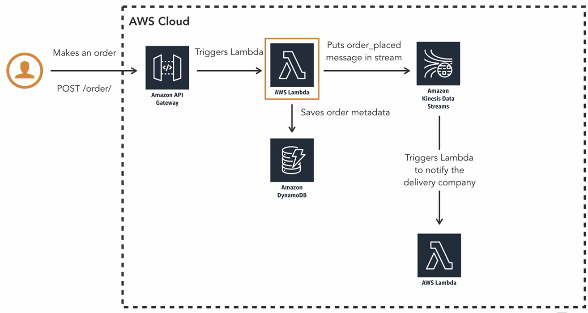
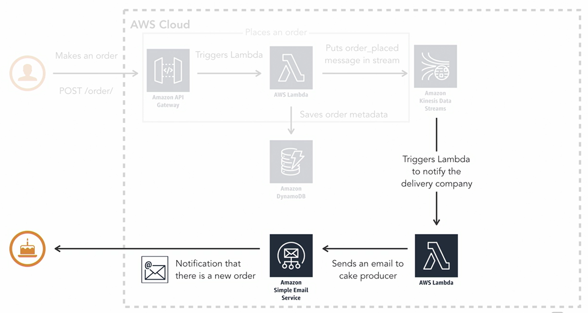
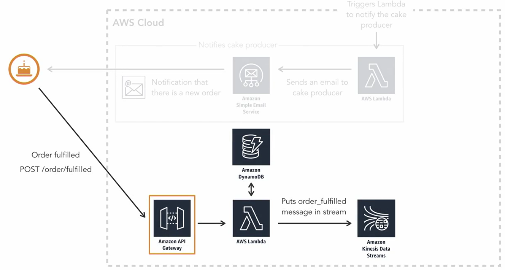
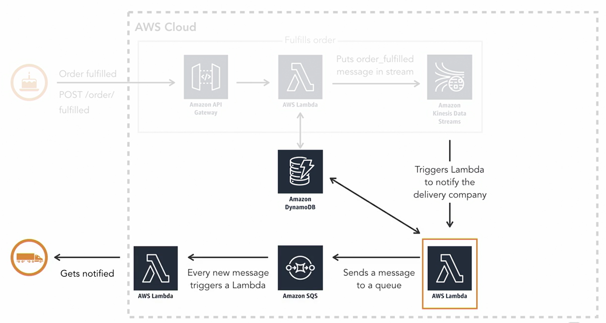
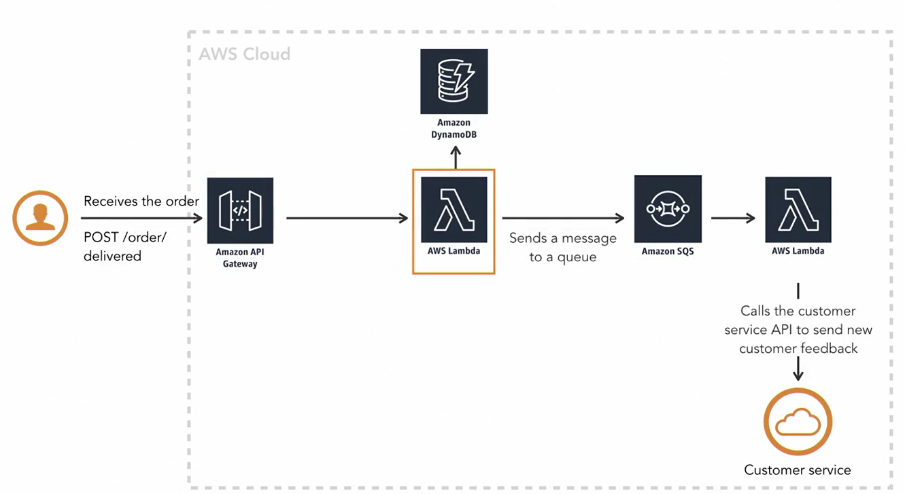

# AWS Certification Task 1

Imagine that you are the owner of an online bakery that sells cakes. Your customers can purchase cakes online and they will get them delivered to their homes some time after. 
For that you need to:
- create a serverless system to do the whole ordering process. 
- model the flow of the data. 
- manage the order in a stream of data. 

### Basic flow:

1. The users order a cake in our online shop. 
2. When that happens, someone needs to notify the cake maker that there is an order and what kind of cake to make. 
3. The order will appear as an email to the cake maker so they know that they have a new order to prepare. 
4. When the cake maker is done making the cake, they will notify the system that the order is fulfilled. 
5. When the order is fulfilled, the system now needs to notify the delivery company to take the cake to the customer. 
6. When the customer receives the cake, they will need to notify the company that they have received it. Now the order is completed and delivered. ☺️ 

### Part 0. Preparation
`npm install -g serverless`

`serverless config credentials --provider aws --key {iam-key} --secret {iam-secret}`

For updating resources in AWS. Run it on demand  
`serverless deploy`

### Part 1. Resources to create

- AWS API Gateway - endpoint to order a cake: POST /order
- AWS Lambda(1) - executes when the client request comes to an endpoint
- AWS Deploy - to deploy application to AWS Account

Result: Application available on: POST https://nvwuhpr1a7.execute-api.us-east-1.amazonaws.com/dev/order

### Part 2. Resources to create

- AWS DynamoDB - called by lambda(1) to store order metadata
- AWS Kinesis Data Streams - called by lambda(1) to save an event "order_placed"
- AWS Lambda(2) - executes when Kinesis wants to notify cake maker

Result: Application available on: POST https://nvwuhpr1a7.execute-api.us-east-1.amazonaws.com/dev/order  
with body:

      {
          "name": "Yana Bahdanovich",
          "address": "Inasaridze 2 deadlock 35",
          "productId": 1,
          "quantity": 3
      }

**Why do we need to store data in stream?**

Data in DynamoDB is static(stores data information), while data in Stream is dynamic(saves an event). This event now can trigger other things. This approach provides better performantce than HTTP requests, as the messages are flowing inside the cloud platform and don't need to go over the Internet.

### Part 3. Resources to create

- AWS Simple Email Service - used by lambda(2) to email cake maker

### Part 4. Resources to create

- AWS API Gateway - endpoint for cake maker, called when cake is ready: POST /order/fulfilled
- AWS Lambda(3) - executes when the cake maker do POST /order/fulfilled
- AWS DynamoDB - called by lambda(3) to update order metadata
- Amazon Kinesis Data Streams - called by lambda(3) to save an event "order_fulfilled"

### Part 5. Resources to create

- AWS Lambda(4) - is triggered by an event "order_fulfilled" in Amazon Kinesis Data Streams
- AWS DynamoDB - called by lambda(4) to update order metadata
- AWS SQS - receives message from lambda(4), calls lambda(5)
- AWS Lambda(5) - notifies Delivery that cake is ready

**Why to use a queue to call another lambda?**

Reason is to keep the system as loosely decoupled as you can!  
Example: if you need to change delivery company, you can do it easily without modifying lambda from the core flow.

### Part 6. Resources to create

- AWS API Gateway - endpoint for client, called when he receives a cake: POST /order/delivered
- AWS Lambda(6) - executes when the client do POST /order/delivered
- AWS DynamoDB - called by lambda(6) to update order metadata

Now the order is completed. Also, Delivery can ask for review/feedback.

- AWS SQS - feedback is sent here by lambda(6) call and trigger the last lambda(7)
- AWS Lambda(7) - will call API in the Customer service to report a feedback that the user provided